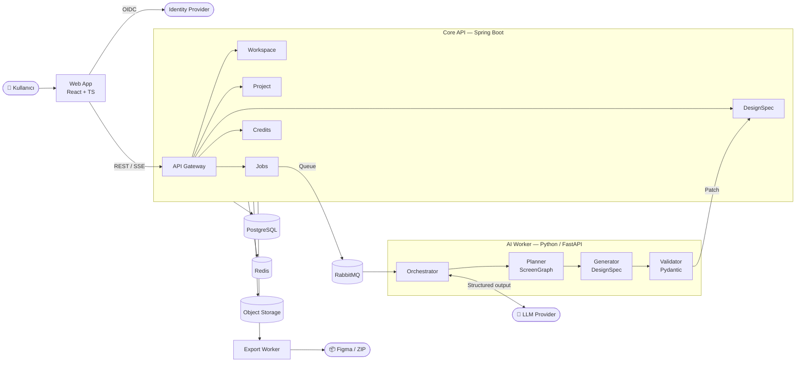
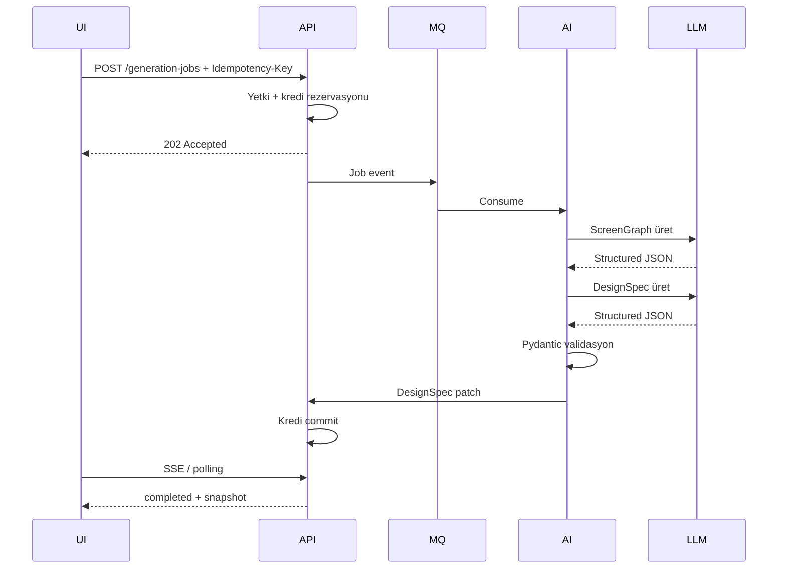

<div align="center">

<br>

```
███████╗██╗      ██████╗ ██████╗ ██╗██╗   ██╗███████╗███╗   ██╗
██╔════╝██║     ██╔═══██╗██╔══██╗██║██║   ██║██╔════╝████╗  ██║
█████╗  ██║     ██║   ██║██████╔╝██║██║   ██║█████╗  ██╔██╗ ██║
██╔══╝  ██║     ██║   ██║██╔══██╗██║╚██╗ ██╔╝██╔══╝  ██║╚██╗██║
██║     ███████╗╚██████╔╝██║  ██║██║ ╚████╔╝ ███████╗██║ ╚████║
╚═╝     ╚══════╝ ╚═════╝ ╚═╝  ╚═╝╚═╝  ╚═══╝  ╚══════╝╚═╝  ╚═══╝
                                                          STUDIO
```

**Doğal dil briefinden dakikalar içinde düzenlenebilir mobil UI tasarımı.**

<br>

[](.)
[](CHANGELOG.md)
[](.)
[](docs/02-architecture/ARCHITECTURE_DECISIONS.md)
[](docs/09-agents/)

<br>

</div>

---

## Ne yapar?

Floriven Studio; kullanıcının doğal dilde verdiği ürün fikrini, marka girdisini veya referans görseli alarak **mobil uygulama ekranları**, **tasarım sistemi** ve **etkileşim akışları** üreten web tabanlı AI-first SaaS ürünüdür. Oluşan ekranlar görsel editörde düzenlenir, sürümlenir ve Figma veya kod formatına dışa aktarılır.

| Sorun | Floriven Studio çözümü |
|---|---|
| Fikir → tasarım geçişi saatler alıyor | Brief'ten düzenlenebilir ekrana dakikalar içinde |
| Tasarım bilgisi sınırlı ekipler tutarsız UI üretiyor | Token tabanlı otomatik tasarım sistemi |
| Tasarım–geliştirme arası çeviri maliyeti yüksek | `DesignSpec` sözleşmesiyle Figma ve kod dışa aktarımı |
| AI çıktısı güvenilmez ve doğrulanamıyor | Pydantic şema validasyonu + guardrail katmanı |

---

## Teknoloji yığını

<div align="center">


</div>

---

## Mimari



<details>
<summary><strong>Üretim akışı (sequence)</strong></summary>



</details>

---

## Dokümantasyon

Bu repo şu an **dokümantasyon paketidir** — kod geliştirme başlamadan önce tüm kararları görünür kılmak ve insan ekiplerle AI agent'ların aynı kurallarla çalışmasını sağlamak için hazırlanmıştır.

### Başlamak için

| Öncelik | Dosya | İçerik |
|:---:|---|---|
| 1 | [`00_START_HERE.md`](00_START_HERE.md) | Başlangıç rehberi |
| 2 | [`docs/01-product/PRODUCT_VISION.md`](docs/01-product/PRODUCT_VISION.md) | Ürünün varoluş nedeni |
| 3 | [`docs/01-product/PRD.md`](docs/01-product/PRD.md) | Uçtan uca gereksinimler |
| 4 | [`docs/01-product/MVP_SCOPE.md`](docs/01-product/MVP_SCOPE.md) | İlk sürüm sınırları |
| 5 | [`docs/02-architecture/SYSTEM_ARCHITECTURE.md`](docs/02-architecture/SYSTEM_ARCHITECTURE.md) | Sistem ve veri akışı |
| 6 | [`docs/02-architecture/DESIGN_SPEC.md`](docs/02-architecture/DESIGN_SPEC.md) | Kanonik tasarım sözleşmesi |
| 7 | [`AGENTS.md`](AGENTS.md) | AI agent çalışma kuralları |

<details>
<summary><strong>Klasör yapısı</strong></summary>

```
Floriven-Studio/
├── 00_START_HERE.md              # Başlangıç rehberi
├── AGENTS.md                     # Agent çalışma kuralları (bağlayıcı)
├── MANIFEST.md                   # Tüm dosyaların bütünlük kaydı
├── docs/
│   ├── 00-brand/                 # Marka kimliği ve ürün adı
│   ├── 01-product/               # Vizyon, PRD, MVP, persona, roadmap
│   ├── 02-architecture/          # Sistem, AI, editör, ADR'ler, DesignSpec
│   ├── 03-engineering/           # API, kodlama standartları, test, performans
│   ├── 04-ai/                    # Prompt mühendisliği, model stratejisi, eval
│   ├── 05-security/              # Güvenlik, tehdit modeli, uyum
│   ├── 06-operations/            # Deployment, gözlemlenebilirlik, runbook'lar
│   ├── 07-business/              # İş modeli, fiyatlandırma, GTM, risk
│   ├── 08-management/            # Yönetişim, RACI, karar günlüğü
│   ├── 09-agents/                # Uzman agent tanımları ve handoff şablonu
│   └── 10-templates/             # ADR, user story, PR, incident şablonları
└── SHA256SUMS.txt                # SHA-256 bütünlük doğrulama
```

</details>

<details>
<summary><strong>Mimari kararlar (ADR)</strong></summary>

| ADR | Karar | Durum |
|---|---|:---:|
| [ADR-0001](docs/02-architecture/ADR-0001.md) | Core API için modüler monolit | ✅ Kabul edildi |
| [ADR-0002](docs/02-architecture/ADR-0002.md) | DesignSpec kanonik ara model | ✅ Kabul edildi |
| [ADR-0003](docs/02-architecture/ADR-0003.md) | AI orkestrasyonu için ayrı Python worker | ✅ Kabul edildi |
| [ADR-0004](docs/02-architecture/ADR-0004.md) | Editörde DOM/SVG-first renderer | ✅ Kabul edildi |
| [ADR-0005](docs/02-architecture/ADR-0005.md) | Monorepo yapısı (Turborepo) | ✅ Kabul edildi |

Yeni kararlar [ADR şablonu](docs/10-templates/ADR_TEMPLATE.md) ile oluşturulur.

</details>

<details>
<summary><strong>MVP backlog özeti</strong></summary>

| Alan | Toplam iş | P0 | P1 | P2 |
|---|:---:|:---:|:---:|:---:|
| Kimlik ve workspace | 3 | 3 | — | — |
| Proje ve DesignSpec | 4 | 2 | 2 | — |
| AI üretim | 6 | 4 | 2 | — |
| Görsel editör | 4 | — | 2 | 2 |
| Kredi sistemi | 3 | 1 | 2 | — |
| Export | 2 | — | 1 | 1 |
| Güvenlik ve uyum | 3 | 3 | — | — |

Detaylar: [`BACKLOG_AND_PRIORITIZATION.md`](docs/01-product/BACKLOG_AND_PRIORITIZATION.md)

</details>

---

## Agent sistemi

Floriven Studio, hem insan hem AI agent'larla çalışmak üzere tasarlanmıştır. 12 uzman agent tanımlıdır:

<div align="center">

| Agent | Sorumluluk |
|---|---|
| [Product](docs/09-agents/PRODUCT_AGENT.md) | Ürün gereksinimleri |
| [Architecture](docs/09-agents/ARCHITECTURE_AGENT.md) | Sistem tasarımı ve ADR'ler |
| [Frontend](docs/09-agents/FRONTEND_AGENT.md) | Web editörü ve UI |
| [Backend](docs/09-agents/BACKEND_AGENT.md) | API, domain ve veri |
| [AI](docs/09-agents/AI_AGENT.md) | Prompt, model ve eval |
| [DevOps](docs/09-agents/DEVOPS_AGENT.md) | CI/CD ve runtime |
| [QA](docs/09-agents/QA_AGENT.md) | Test ve kalite |
| [Security](docs/09-agents/SECURITY_AGENT.md) | Güvenlik kontrolleri |
| [Data](docs/09-agents/DATA_AGENT.md) | Analitik ve veri |
| [Documentation](docs/09-agents/DOCUMENTATION_AGENT.md) | Doküman tutarlılığı |
| [Review](docs/09-agents/REVIEW_AGENT.md) | Kod inceleme |
| [Support](docs/09-agents/SUPPORT_AGENT.md) | Kullanıcı desteği |

</div>

Tüm agent'lar [`AGENTS.md`](AGENTS.md) kurallarına tabidir.

---

## Katkı

Katkıda bulunmadan önce [`CONTRIBUTING.md`](CONTRIBUTING.md) ve [`AGENTS.md`](AGENTS.md) dosyalarını oku. Tüm mimari değişiklikler ADR ile kayıt altına alınır.

[](CODE_OF_CONDUCT.md)
[](CONTRIBUTING.md)

---

<div align="center">
<sub>Floriven Studio — AI destekli mobil UI tasarım platformu</sub>
</div>
