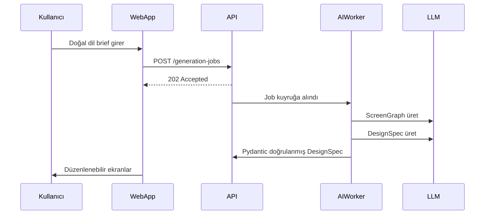

# Floriven Studio

> Doğal dil briefinden dakikalar içinde düzenlenebilir mobil UI tasarımı.

[](#)
[](#)
[](#dokümantasyon)

Floriven Studio; kullanıcının doğal dilde verdiği ürün fikrini, marka girdilerini veya referans görseli alarak mobil uygulama ekranları, tasarım sistemi ve etkileşim akışları üreten web tabanlı bir AI-first SaaS ürünüdür. Oluşan ekranlar görsel editörde düzenlenir, sürümlenir ve Figma veya kod formatına dışa aktarılır.

---

## Neden Floriven Studio?

| Sorun | Çözüm |
|---|---|
| Fikir → tasarım geçişi saatler alıyor | Brief'ten düzenlenebilir ekrana dakikalar içinde |
| Tasarım bilgisi sınırlı ekipler tutarsız UI üretiyor | Token tabanlı otomatik tasarım sistemi |
| Tasarım–geliştirme arasında çeviri maliyeti yüksek | `DesignSpec` sözleşmesiyle Figma ve kod dışa aktarımı |
| AI çıktısı güvenilmez ve doğrulanamıyor | Pydantic şema validasyonu + guardrail katmanı |

---

## Teknoloji Yığını

```
Web          →  React + TypeScript (SSR/SPA)
API          →  Java 21 + Spring Boot 3.x  (modüler monolit)
AI Worker    →  Python + FastAPI + Pydantic
Veritabanı   →  PostgreSQL · Redis · S3 uyumlu depolama
Mesajlaşma   →  RabbitMQ
Kimlik       →  OIDC / OAuth 2.1
Gözlemlenebilirlik → OpenTelemetry
```

---

## Dokümantasyon

Bu repo şu an **dokümantasyon paketidir** — kod geliştirme başlamadan önce tüm kararları görünür kılmak ve insan ekiplerle AI agent'ların aynı kurallarla çalışmasını sağlamak amacıyla hazırlanmıştır.

### Başlamak için

1. [`00_START_HERE.md`](00_START_HERE.md) — önce bunu oku
2. [`docs/01-product/PRODUCT_VISION.md`](docs/01-product/PRODUCT_VISION.md) — ürünün varoluş nedeni
3. [`docs/01-product/PRD.md`](docs/01-product/PRD.md) — uçtan uca gereksinimler
4. [`docs/01-product/MVP_SCOPE.md`](docs/01-product/MVP_SCOPE.md) — ilk sürüm sınırları
5. [`docs/02-architecture/SYSTEM_ARCHITECTURE.md`](docs/02-architecture/SYSTEM_ARCHITECTURE.md) — sistem ve veri akışı
6. [`docs/02-architecture/DESIGN_SPEC.md`](docs/02-architecture/DESIGN_SPEC.md) — kanonik tasarım veri sözleşmesi
7. [`AGENTS.md`](AGENTS.md) — AI agent'lar için bağlayıcı çalışma kuralları

### Klasör yapısı

```
Floriven-Studio/
├── 00_START_HERE.md          # Başlangıç rehberi
├── AGENTS.md                 # Agent çalışma kuralları (bağlayıcı)
├── MANIFEST.md               # Tüm dosyaların SHA-256 bütünlük kaydı
├── docs/
│   ├── 00-brand/             # Marka kimliği ve ürün adı
│   ├── 01-product/           # Vizyon, PRD, MVP, persona, roadmap
│   ├── 02-architecture/      # Sistem, AI, editör, ADR'ler, DesignSpec
│   ├── 03-engineering/       # API, kodlama standartları, test, performans
│   ├── 04-ai/                # Prompt mühendisliği, model stratejisi, eval
│   ├── 05-security/          # Güvenlik, tehdit modeli, uyum
│   ├── 06-operations/        # Deployment, gözlemlenebilirlik, runbook'lar
│   ├── 07-business/          # İş modeli, fiyatlandırma, GTM, risk
│   ├── 08-management/        # Yönetişim, RACI, karar günlüğü
│   ├── 09-agents/            # Uzman agent tanımları ve handoff şablonu
│   └── 10-templates/         # ADR, user story, PR, incident şablonları
└── SHA256SUMS.txt            # Dosya bütünlük doğrulama
```

### Mimari kararlar (ADR)

| ADR | Karar | Durum |
|---|---|---|
| [ADR-0001](docs/02-architecture/ADR-0001.md) | Core API için modüler monolit | Kabul edildi |
| [ADR-0002](docs/02-architecture/ADR-0002.md) | DesignSpec kanonik ara model | Kabul edildi |
| [ADR-0003](docs/02-architecture/ADR-0003.md) | AI orkestrasyonu için ayrı Python worker | Kabul edildi |
| [ADR-0004](docs/02-architecture/ADR-0004.md) | Editörde DOM/SVG-first renderer | Kabul edildi |

---

## Üretim akışı



---

## Katkı

Katkıda bulunmadan önce [`CONTRIBUTING.md`](CONTRIBUTING.md) ve [`AGENTS.md`](AGENTS.md) dosyalarını oku. Tüm mimari değişiklikler [`docs/10-templates/ADR_TEMPLATE.md`](docs/10-templates/ADR_TEMPLATE.md) şablonuyla kayıt altına alınır.

Davranış kuralları: [`CODE_OF_CONDUCT.md`](CODE_OF_CONDUCT.md)
