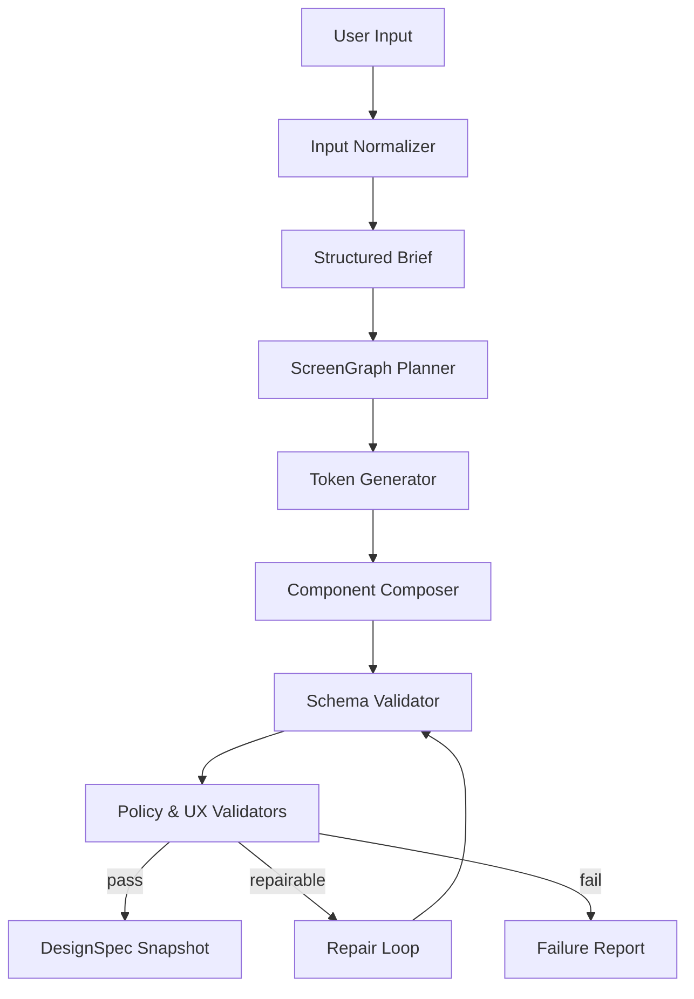

# AI Mimarisi

| Alan | Değer |
|---|---|
| Proje | Floriven Studio |
| Durum | Onay gerekli |
| Doküman sahibi | AI Lead |
| Son güncelleme | 2026-08-05 |
| Gözden geçirme | Aylık |

> Projenin resmî ürün adı **Floriven Studio** olarak belirlenmiştir. Mimari kararlar uygulamaya geçmeden önce ilgili ADR ile onaylanır.
## Hedef

Kullanıcı niyetini güvenli, ölçülebilir ve sağlayıcıdan bağımsız biçimde geçerli DesignSpec'e dönüştürmek. Model, sistemin tek doğruluk kaynağı değildir; öneri üretir, deterministic kurallar doğrular.

## Pipeline

## Aşamalar

1. **Normalizasyon:** Dil, uygulama türü, hedef kullanıcı, platform ve kısıtlar çıkarılır.
2. **Planlama:** Ekran amaçları, navigasyon ve gerekli veri durumları ScreenGraph olarak oluşturulur.
3. **Token üretimi:** Renk, tipografi, spacing ve radius semantik isimlerle belirlenir.
4. **Kompozisyon:** Yalnız registry'deki component türleriyle ağaç kurulur.
5. **Validasyon:** JSON Schema, referential integrity, layout, erişilebilirlik ve güvenlik kontrolleri.
6. **Repair:** Hata listesi modele veya deterministic düzelticiye verilir; tur sayısı sınırlandırılır.
7. **Kalıcılaştırma:** Geçerli sonuç immutable snapshot olarak kaydedilir.

## Model görevleri

| Görev | Beklenen yetenek | Çıktı |
|---|---|---|
| Brief çıkarma | Metin sınıflandırma/özet | StructuredBrief |
| ScreenGraph | Planlama ve ürün bilgisi | ScreenGraph JSON |
| DesignSpec | Structured generation | DesignSpec JSON |
| Patch | Hassas referans ve değişiklik | JSON Patch-benzeri işlem |
| Copy | Ton ve lokalizasyon | Text bundle |
| Görsel analiz | Referans stili/yerleşim | Güvenli özellik özeti |

## Sağlayıcı soyutlaması

Domain katmanı `ModelCapability` ister: structured-output, vision, context-size, latency-tier ve data-policy. Adapter sağlayıcı API'sine çevirir. Model değişimi yalnız config/routing katmanını etkilemelidir.

## Deterministic katman

- Şema doğrulama ve varsayılan değerler.
- Component allowlist ve property aralıkları.
- Kontrast, dokunma hedefi, ekran dışına taşma kontrolleri.
- Node ID benzersizliği ve referans doğrulama.
- Kredi hesaplama ve job state machine.

## Bağlam yönetimi

Prompt'a tüm proje ham olarak verilmez. İlgili ekran alt ağacı, token seti, component contract ve kısa proje özeti seçilir. Büyük projelerde özet + retrieval kullanılır. Kullanıcı yüklemelerindeki metin sistem talimatı olarak yorumlanmaz.

## Failure mode'lar

- Geçersiz JSON: structured output + parser repair.
- Registry dışı bileşen: mapping veya reddetme.
- Tutarsız ekranlar: shared token/component pass.
- Aşırı maliyet: token budget, model routing ve erken durdurma.
- Prompt injection: content boundary, allowlist ve tool isolation.
- Sağlayıcı kesintisi: circuit breaker, alternatif model ve job retry.
