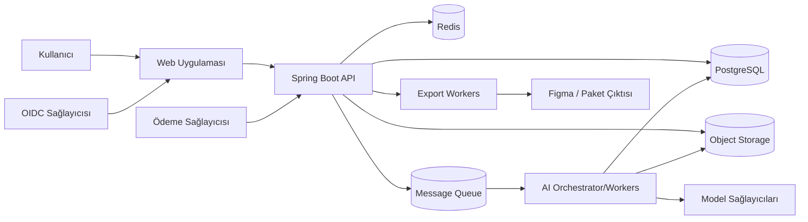
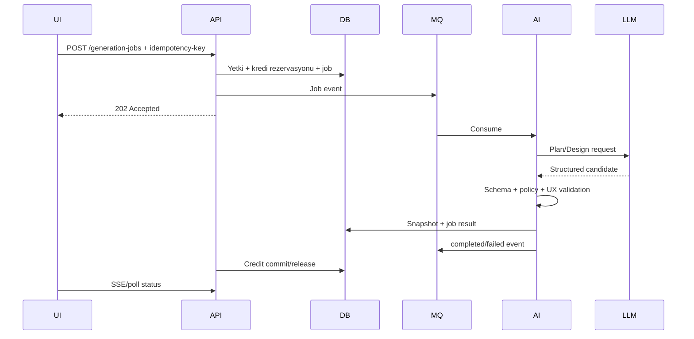

# Sistem Mimarisi

| Alan | Değer |
|---|---|
| Proje | Floriven Studio |
| Durum | Onay gerekli |
| Doküman sahibi | Solution Architect |
| Son güncelleme | 2026-08-05 |
| Gözden geçirme | Her ana değişiklik |

> Projenin resmî ürün adı **Floriven Studio** olarak belirlenmiştir. Mimari kararlar uygulamaya geçmeden önce ilgili ADR ile onaylanır.
## Mimari hedefler

- AI sağlayıcısından bağımsız domain modeli.
- Tenant izolasyonu ve kredi doğruluğu.
- Uzun süren işleri asenkron, iptal edilebilir ve gözlemlenebilir yürütme.
- Editörde hızlı yerel etkileşim ve güvenilir autosave.
- Sözleşme tabanlı frontend/backend/AI geliştirmesi.

## Bağlam diyagramı

## Mantıksal bileşenler

### Web uygulaması

Dashboard, onboarding, editör, preview, faturalama ve admin yüzeyleri. DesignSpec'in istemci kopyasını yönetir; yetki ve kredi kararlarını vermez.

### Core API

Kimlik bağlama, workspace/proje, DesignSpec sürümleme, job orchestration, kredi ledger, export ve audit domain'lerinin doğruluk kaynağıdır.

### AI Orchestrator

Brief normalizasyonu, ScreenGraph, DesignSpec üretimi, patch, validasyon/düzeltme ve model routing görevlerini yürütür. Provider yanıtını doğrudan kalıcılaştırmaz.

### Worker katmanı

Generation, export, görsel işleme ve temizlik işleri ayrı queue/consumer gruplarıyla çalışır. Her iş idempotent iş kimliği taşır.

### Veri katmanı

- PostgreSQL: tenant, proje, sürüm, job, kredi ve audit.
- Redis: kısa süreli cache, distributed lock, rate limit ve presence benzeri geçici durum.
- Object storage: yüklemeler, export paketleri, thumbnails ve büyük snapshot payload'ları.

## Ana üretim akışı

## Dağıtım birimleri

MVP'de modüler monolit Core API + ayrı AI worker uygun varsayımdır. Domain'ler modül sınırlarıyla ayrılır; trafik ve ekip ölçeği kanıtlanmadan mikroservise bölünmez. AI ve export iş yükleri bağımsız ölçeklenir.

## Tutarlılık modeli

- Kredi ve job oluşturma aynı veri transaction'ında.
- Queue yayınlama transactional outbox ile.
- Editör autosave optimistic concurrency (`revision`) ile.
- Export ve AI sonuçları yeni snapshot üretir; mevcut snapshot değişmez.
- Object storage yüklemesi DB kaydıyla iki aşamalı ve cleanup job'uyla uzlaştırılır.

## Hata stratejisi

Timeout, retry ve circuit breaker provider/adapter sınırında uygulanır. İşin tekrar çalışması aynı snapshot'ı veya ikinci kredi kesintisini oluşturmamalıdır. Kalıcı hatalar DLQ'ya taşınır ve admin eylemi audit edilir.
